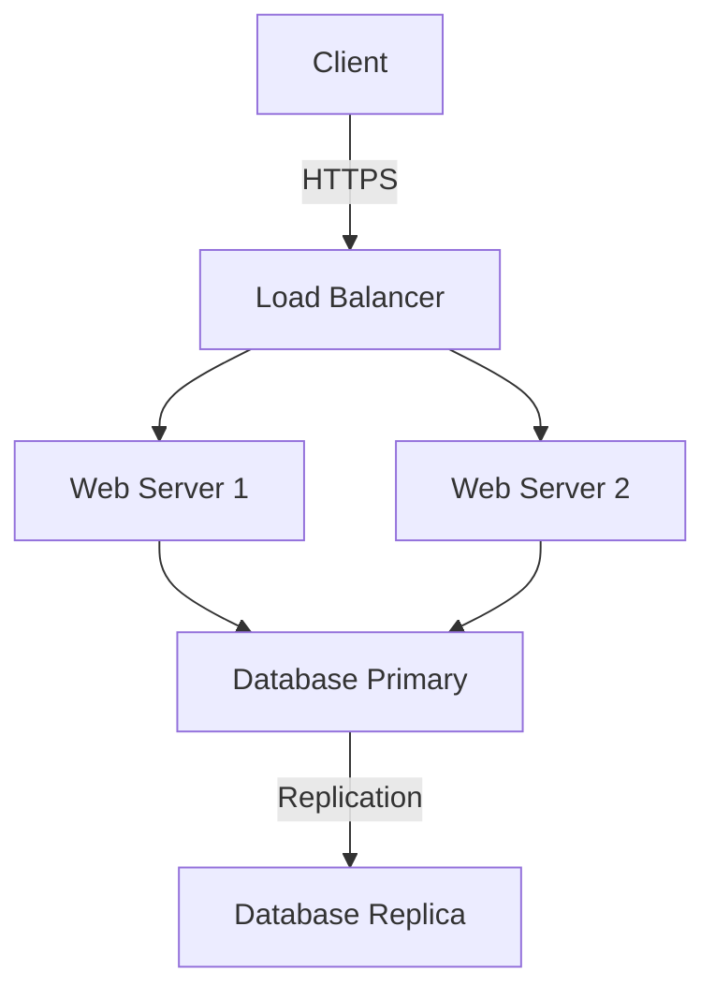
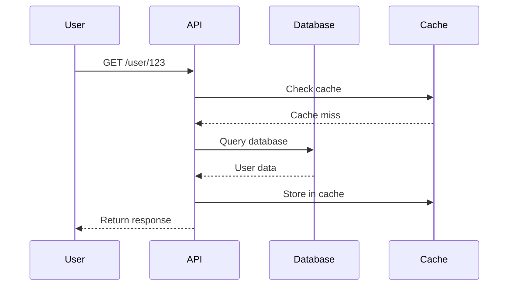

theme: Courier, 1
footer: Technical Deep Dive
slidenumbers: true
autoscale: true

---

# Technical Deep Dive
## Advanced Deckset Features for Developers

### John Developer
### 2024-01-15

---

## Agenda

1. Development workflow integration
2. Code presentation best practices
3. Diagram generation with Mermaid
4. Advanced formatting techniques
5. Tips for technical talks

^ Cover each section in about 5 minutes
^ Allow time for questions at the end
^ Have demo ready for Mermaid section

---

## Why Markdown for Tech Talks?

**Advantages:**
- ✅ Version control with git
- ✅ Fast iteration and updates
- ✅ Focus on content, not design
- ✅ Easy collaboration via PRs
- ✅ Plain text = universal format

^ Emphasize the developer workflow benefits
^ Compare to PowerPoint/Keynote limitations

---

## Project Structure

```
my-talk/
├── presentation.md
├── images/
│   ├── architecture.png
│   └── screenshot.png
├── code-samples/
│   └── demo.py
└── README.md
```

^ Keep everything in one repository
^ Makes it easy to share and collaborate

---

## Code Syntax Highlighting

Python example:

```python
def calculate_fibonacci(n: int) -> list[int]:
    """Generate Fibonacci sequence up to n terms."""
    if n <= 0:
        return []
    elif n == 1:
        return [0]

    fib = [0, 1]
    for i in range(2, n):
        fib.append(fib[i-1] + fib[i-2])
    return fib
```

^ Deckset automatically detects language
^ Supports 100+ programming languages

---

## JavaScript Example

```javascript
// Async/await pattern
async function fetchUserData(userId) {
  try {
    const response = await fetch(`/api/users/${userId}`);
    const data = await response.json();
    return data;
  } catch (error) {
    console.error('Failed to fetch user:', error);
    throw error;
  }
}
```

---

## Shell Commands

```bash
# Setup development environment
git clone https://github.com/user/project.git
cd project

# Install dependencies
npm install

# Run tests
npm test

# Start development server
npm run dev
```

^ Use bash syntax for terminal commands
^ Great for setup instructions

---

## SQL Queries

```sql
SELECT
    u.username,
    COUNT(p.id) as post_count,
    MAX(p.created_at) as last_post
FROM users u
LEFT JOIN posts p ON u.id = p.user_id
WHERE u.active = true
GROUP BY u.id, u.username
HAVING COUNT(p.id) > 5
ORDER BY post_count DESC
LIMIT 10;
```

---

## Architecture Diagrams



^ Mermaid generates diagrams from text
^ Great for architecture and flowcharts

---

## Sequence Diagram



^ Perfect for explaining API flows
^ Shows interaction between components

---

## Formulas and Math

For algorithmic complexity:

$
O(n \log n)
$

The quadratic formula:

$
x = \frac{-b \pm \sqrt{b^2-4ac}}{2a}
$

^ Use LaTeX syntax for mathematical expressions
^ Essential for algorithm analysis talks

---

## Inline Math

When analyzing time complexity, we often see $O(n)$ for linear algorithms or $O(1)$ for constant time operations.

The space complexity of the recursive solution is $O(n)$ due to the call stack.

---

## Multiple Code Languages

**Input validation** (TypeScript):
```typescript
interface User {
  id: number;
  email: string;
  role: 'admin' | 'user';
}

function validateUser(data: unknown): User {
  // Validation logic here
  return data as User;
}
```

---

## API Response Example

```json
{
  "status": "success",
  "data": {
    "userId": 12345,
    "username": "johndoe",
    "email": "john@example.com",
    "roles": ["developer", "admin"],
    "lastLogin": "2024-01-15T10:30:00Z"
  },
  "meta": {
    "timestamp": 1705317000,
    "version": "v2"
  }
}
```

^ JSON is automatically highlighted
^ Great for API documentation

---

## Configuration Files

**Docker Compose:**

```yaml
version: '3.8'
services:
  web:
    build: .
    ports:
      - "3000:3000"
    environment:
      - NODE_ENV=production
    depends_on:
      - db
  db:
    image: postgres:15
    volumes:
      - db-data:/var/lib/postgresql/data
volumes:
  db-data:
```

---

## Git Integration

```bash
# Commit your presentation changes
git add presentation.md
git commit -m "Add technical deep dive slides"

# Create a branch for major updates
git checkout -b update-architecture-section

# Share with colleagues
git push origin main
```

^ Version control is a huge advantage
^ Easy to track changes and collaborate

---

## Presenter Notes Tips

^ Use presenter notes liberally
^ They don't appear on slides
^ Perfect for:
^ - Talking points
^ - Timing reminders
^ - Demo instructions
^ - Backup explanations

---

## Tables for Comparisons

| Approach    | Complexity | Memory | Best For          |
|-------------|-----------|--------|-------------------|
| HashMap     | O(1)      | High   | Fast lookups      |
| Binary Tree | O(log n)  | Medium | Sorted data       |
| Array       | O(n)      | Low    | Sequential access |

^ Tables are great for feature comparisons
^ Keep them simple and readable

---

## Build Steps

Lists can be revealed progressively:

1. First point appears
2. Then the second
3. Finally the third

Enable with `build-lists: true` in config.

^ This keeps audience focused
^ Reveal one point at a time

---

## [fit] Fit Text to Slide
## [fit] For Maximum Impact

^ Use [fit] modifier for emphasis
^ Great for chapter transitions

---

## Best Practices

**Do:**
- Keep code examples short and focused
- Use syntax highlighting
- Include comments for clarity
- Test all code before presenting

**Don't:**
- Show too much code at once
- Use tiny fonts
- Include irrelevant details
- Skip error handling examples

^ These practices ensure clear communication
^ Technical audiences appreciate working code

---

## Demo Time

```python
# Live coding example
import requests

def fetch_api_data():
    response = requests.get('https://api.example.com/data')
    return response.json()

# Execute and show results
```

^ Prepare demo environment beforehand
^ Have backup slides if demo fails

---

## Resources for Developers

- **Deckset**: decksetapp.com
- **Mermaid**: mermaid.js.org
- **Syntax Highlighting**: github.com/rouge-ruby/rouge
- **LaTeX Math**: katex.org

^ Share these resources with the audience
^ Provide links in speaker notes

---

## Advanced Tips

1. Use git tags for presentation versions
2. Automate PDF export with scripts
3. Include code from actual files with includes
4. Use CI/CD to validate markdown
5. Share presentations via GitHub Pages

^ These tips are for power users
^ Mention them briefly, don't dive deep

---

# Questions?
## Let's Discuss

**Contact:**
- Email: john@example.com
- GitHub: @johndeveloper
- Twitter: @johndev

^ Be ready for technical questions
^ Have backup slides for common questions

---

[.hide-footer]

# Thank You!

## Slides available at:
### github.com/user/technical-talk

^ Direct people to the repository
^ Encourage them to clone and learn from the markdown
