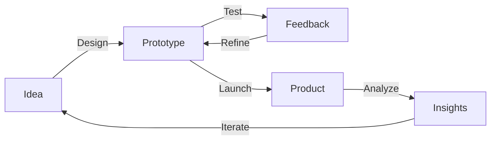
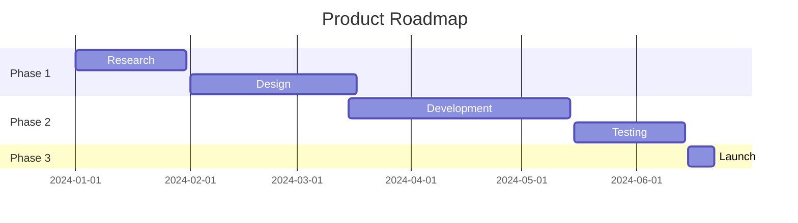

theme: Zurich, 1
footer: Visual Storytelling
slidenumbers: true

---

[.background-color: #1a1a1a]
[.text: #ffffff]

# Visual Storytelling
## The Art of Image-Driven Presentations

### A Deckset Showcase

---

## Why Visual Presentations?

Research shows:
- 🧠 Brain processes images 60,000x faster than text
- 👁️ 90% of information transmitted to brain is visual
- 📊 People remember 80% of what they see
- 📖 Only 20% of what they read

^ Emphasize the power of visual communication
^ Reference studies if asked
^ This sets up why we focus on images

---

## Planning Your Visual Story

1. **Define your message** - What's the core idea?
2. **Find great images** - Quality matters
3. **Create flow** - Visual narrative arc
4. **Balance text and images** - Less text, more impact
5. **Practice transitions** - Smooth storytelling

^ Each presentation needs a clear narrative
^ Images should support, not distract

---


# [fit] Technology
# [fit] Shapes Our Future

^ Full-screen background image example
^ Note: Replace with actual local image paths
^ Text overlays work great on dark images

---


## Data Visualization

Modern tools allow us to:
- Transform complex data
- Reveal hidden patterns
- Tell compelling stories
- Drive decision-making

^ Left-aligned image example
^ Content appears on the right side
^ Great for before/after comparisons

---


## Analytics Matter

**Key Metrics:**
- User engagement: +45%
- Conversion rate: +32%
- Customer satisfaction: 4.8/5
- Revenue growth: +28%

^ Right-aligned image with filter
^ Numbers stand out on simple backgrounds

---

## Image Composition


^ Two images side by side
^ Perfect for comparisons
^ Can show before/after, A/B testing, etc.

---

## Image Grid Layout


^ Four images in a grid
^ Great for showcasing team, products, or features
^ Keep images consistent in style

---


## [fit] Collaboration
## [fit] Drives Innovation

^ Dark image with light text overlay
^ [fit] ensures text scales appropriately
^ Creates dramatic impact

---

## Custom Image Sizing


Control image size with percentage modifiers:
- `![inline 25%]` - Quarter size
- `![inline 50%]` - Half size
- `![inline 75%]` - Three-quarters
- `![inline fill]` - Fill available space

^ Precise control over image dimensions
^ Useful for logos and icons

---

## Rounded Corners


Add rounded corners to soften the look:

```markdown

```

^ Modern, friendly aesthetic
^ Great for profile pictures or UI screenshots

---


## Product Showcase

**Features:**
- 🎯 Intuitive interface
- ⚡ Lightning fast
- 🔒 Secure by design
- 🌍 Global reach

^ Product images on left, features on right
^ Icons add visual interest to text
^ Keep bullet points short

---

## Video Integration

Videos can be embedded directly:

```markdown


```

**Options:**
- `autoplay` - Start automatically
- `loop` - Repeat continuously
- `mute` - Silence audio

^ Videos must be local files
^ Keep videos short (under 30 seconds)
^ Test playback before presenting

---

[.column]

## Left Column

Content for the left side:
- Statistics
- Benefits
- Features

[.column]


^ Two-column layout with mixed content
^ Text left, image right
^ Great for detailed explanations

---


# Customer Success Story

> "This solution transformed our workflow and increased productivity by 3x."

**— Sarah Johnson, CEO**

^ Quote overlay on background image
^ Testimonials are powerful with visuals
^ Use high-quality professional photos

---

## Before & After


**Before:** Manual processes
**After:** Automated workflow

^ Visual proof of improvement
^ Side-by-side comparison is compelling

---

## Image Best Practices

**Do:**
- ✅ Use high-resolution images (1920x1080+)
- ✅ Maintain consistent style
- ✅ Optimize file sizes (keep under 5MB)
- ✅ Use meaningful images that support your message

**Don't:**
- ❌ Use low-quality or pixelated images
- ❌ Mix incompatible styles
- ❌ Overload slides with too many images
- ❌ Use images just for decoration

^ Quality over quantity always
^ Every image should serve a purpose

---

## Finding Great Images

**Free resources:**
- Unsplash - unsplash.com
- Pexels - pexels.com
- Pixabay - pixabay.com

**Premium:**
- Adobe Stock
- Shutterstock
- Getty Images

^ Always check licensing
^ Give attribution when required

---

## Mermaid Diagrams



^ Diagrams are visual too!
^ Great for processes and flows
^ Auto-generated from text

---

## Timeline Visualization



^ Gantt charts from markdown
^ Perfect for project timelines

---


[.text: #ffffff]

# Visual Hierarchy

## Use Size
## And Position
### To Guide Attention

^ Demonstrate visual hierarchy
^ Larger text draws the eye first
^ Strategic placement matters

---

## Color and Mood

[.background-color: #FF6B6B]
[.text: #ffffff]

### Energetic & Bold

---

## Color and Mood

[.background-color: #4ECDC4]
[.text: #ffffff]

### Calm & Professional

---

## Color and Mood

[.background-color: #95E1D3]
[.text: #2C3E50]

### Fresh & Modern

^ Colors evoke emotions
^ Choose palettes that match your message
^ Be consistent throughout

---

## Contrast is Key


[.text: #ffffff, alignment(center)]

# [fit] Light Text on Dark Images

^ High contrast ensures readability
^ Test on projector if possible
^ Avoid busy backgrounds under text

---

## Typography Matters

# Large Heading
## Regular Heading
### Small Heading

Use heading hierarchy to create **visual rhythm** and guide the viewer's eye through your content.

^ Don't just use bold for everything
^ Proper heading levels create structure

---

## Combining Elements


**Key Metrics:**

| Quarter | Revenue | Growth |
|---------|---------|--------|
| Q1      | $2.4M   | +18%   |
| Q2      | $3.1M   | +29%   |
| Q3      | $3.8M   | +23%   |

^ Mix images, tables, and text
^ Each element supports the narrative
^ Don't overcrowd the slide

---

## Presenting Tips

1. **Arrive early** - Test image display
2. **Check colors** - Projectors vary
3. **Have backup** - PDF export ready
4. **Practice timing** - Know when images appear
5. **Tell stories** - Connect images to narrative

^ Technical preparation is crucial
^ Images lose impact if poorly displayed

---


## Remote Presentations

**Consider:**
- Screen resolution limits
- Bandwidth constraints
- Platform compatibility
- Viewer attention span

^ Virtual presentations need special care
^ Test on actual video conferencing tool

---

## Export Options

Deckset can export to:
- 📄 PDF (with presenter notes)
- 🖼️ Images (PNG/JPEG)
- 📹 Video (coming soon)

```bash
# Command line export
deckset export presentation.md
```

^ Share visual decks easily
^ PDF maintains quality

---

## Accessibility

**Make visuals accessible:**
- Use alt text (in presenter notes)
- Ensure sufficient contrast
- Don't rely solely on color
- Provide text descriptions
- Test with screen readers

^ Inclusive design reaches more people
^ Alt text in notes helps accessibility

---


# [fit] Every Image
# [fit] Tells a Story

^ Choose images intentionally
^ They should enhance, not distract

---

## Final Checklist

- [ ] All images high resolution?
- [ ] Consistent visual style?
- [ ] Colors work on projector?
- [ ] File sizes optimized?
- [ ] Backup copy ready?
- [ ] Presenter notes complete?

^ Go through before presentation day
^ Prevent technical issues

---

[.hide-footer]
[.background-color: #2C3E50]
[.text: #ffffff, alignment(center)]

# Thank You

## Questions?

### Connect: @visualstoryteller

^ End with clean, simple slide
^ Make contact info visible
^ Hide footer for cleaner look
